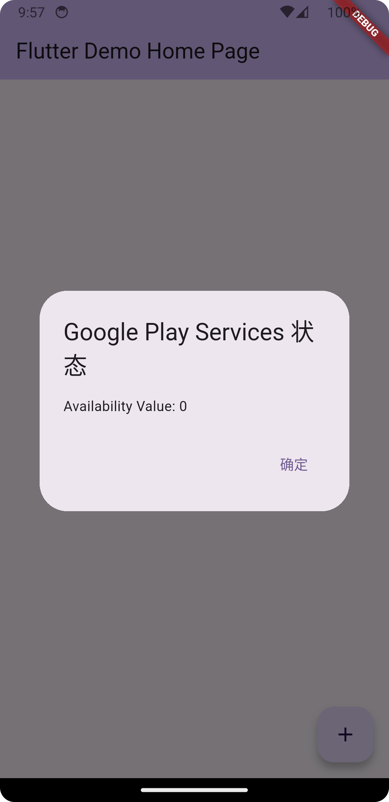

# fcm

## System Prerequisites
```shell
$ flutter doctor -v
[✓] Flutter (Channel stable, 3.29.3, on macOS 15.4.1 24E263 darwin-arm64, locale zh-Hans-CN) [726ms]
    • Flutter version 3.29.3 on channel stable at /Users/clee/src/flutter
    • Upstream repository https://github.com/flutter/flutter.git
    • Framework revision ea121f8859 (4 周前), 2025-04-11 19:10:07 +0000
    • Engine revision cf56914b32
    • Dart version 3.7.2
    • DevTools version 2.42.3
    • Pub download mirror https://pub.flutter-io.cn
    • Flutter download mirror https://storage.flutter-io.cn

[✓] Android toolchain - develop for Android devices (Android SDK version 36.0.0) [3.8s]
    • Android SDK at /Users/clee/Library/Android/sdk
    • Platform android-35, build-tools 36.0.0
    • Java binary at: /opt/homebrew/opt/openjdk@17/libexec/openjdk.jdk/Contents/Home/bin/java
      This JDK is specified in your Flutter configuration.
      To change the current JDK, run: `flutter config --jdk-dir="path/to/jdk"`.
    • Java version OpenJDK Runtime Environment Homebrew (build 17.0.15+0)
    • All Android licenses accepted.

[✓] Xcode - develop for iOS and macOS (Xcode 16.3) [2.4s]
    • Xcode at /Applications/Xcode.app/Contents/Developer
    • Build 16E140
    • CocoaPods version 1.16.2

[✓] Chrome - develop for the web [19ms]
    • Chrome at /Applications/Google Chrome.app/Contents/MacOS/Google Chrome

[✓] Android Studio (version 2024.3) [18ms]
    • Android Studio at /Applications/Android Studio.app/Contents
    • Flutter plugin can be installed from:
      🔨 https://plugins.jetbrains.com/plugin/9212-flutter
    • Dart plugin can be installed from:
      🔨 https://plugins.jetbrains.com/plugin/6351-dart
    • Java version OpenJDK Runtime Environment (build 21.0.6+-13355223-b631.42)

[✓] VS Code (version 1.99.3) [17ms]
    • VS Code at /Applications/Visual Studio Code.app/Contents
    • Flutter extension version 3.60.0

[✓] VS Code (version 1.85.2) [16ms]
    • VS Code at /Applications/Visual Studio Code_副本.app/Contents
    • Flutter extension version 3.60.0

[✓] VS Code (version 1.85.2) [16ms]
    • VS Code at /Users/clee/Downloads/Visual Studio Code.app/Contents
    • Flutter extension version 3.60.0

[✓] Proxy Configuration [55ms]
    • HTTP_PROXY is set
    • NO_PROXY is localhost,127.0.0.1,::1
    • NO_PROXY contains localhost
    • NO_PROXY contains 127.0.0.1
    • NO_PROXY contains ::1

[✓] Connected device (4 available) [13.2s]    
    • sdk gphone64 arm64 (mobile)     • emulator-5554         • android-arm64  • Android 14 (API 34) (emulator)
    • macOS (desktop)                 • macos                 • darwin-arm64   • macOS 15.4.1 24E263 darwin-arm64
    • Mac Designed for iPad (desktop) • mac-designed-for-ipad • darwin         • macOS 15.4.1 24E263 darwin-arm64
    • Chrome (web)                    • chrome                • web-javascript • Google Chrome 136.0.7103.93

[✓] Network resources [1,477ms]
    • All expected network resources are available.

• No issues found!
```

## Getting Started
```shell
# 清除Flutter项目的构建缓存和生成文件
$ flutter clean

# 安装pubspec.yaml中声明的依赖项
$ flutter pub get

# 编译并运行应用到连接的设备或模拟器上
$ flutter run
```
目前个人经验满足下述三个条件，手机才能正常收到FCM推送
1. 系统打开app通知
2. GMS状态为0
3. 手机支持科学上网

> Andriod 13+会有下图弹窗，低于此版本的请通过手机配置打开app通知
<p align="center">
  
</p>

> 显式获取FCM Token，用于Firebase推送
<p align="center">
  
</p>

> 状态为0说明手机支持FCM推送
<p align="center">
  
</p>

> Pixel 3a演示视频，包括打开app、将app切入后台运行以及彻底关闭app进程三种场景，验证显示此三种场景下均可以收到推送 

https://github.com/user-attachments/assets/b518b618-d4a7-4032-93e2-097e8f45b960

> 使用oppo实体机演示，在打开app和将app切入后台运行是可以收到推送的；但是彻底关闭app进程后是收不到FCM推送[TODO]

